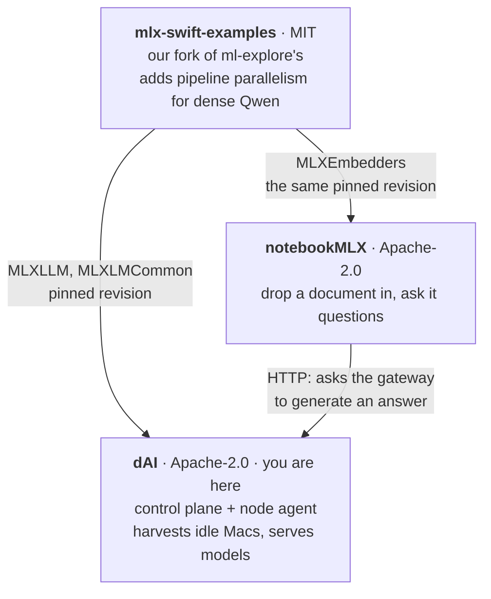

# dAI - Distributed AI on Harvested Apple Silicon

Centrally scheduled compute harvested from idle Apple Silicon workstations: AI
inference today, distributed rendering as a second work kind on the same agent.

The premise comes from the second-GPU render farm: hardware that is already
bought and sits idle 16 hours a day can do useful work at a marginal cost of
roughly electricity - and, critically, without data ever leaving the building.

**Positioning is sovereignty and sunk cost, not price-performance.** Per-token,
harvested Macs lose to both cloud APIs and rented GPUs. The winning arguments
are that the marginal cost is electricity and that the data stays on premises.

## Three repositories, and how they fit

**This one is the fleet.** It schedules idle Macs and serves models from them.
Two others came out of it, and neither is optional reading if you are trying to
work out where a piece of this lives.



| | What it is | Why it is separate |
|---|---|---|
| **[dAI](https://github.com/djsincla/dAI)** | Control plane and node agent. Machines enrol, get approved, take work, and yield when someone touches the keyboard. Serves whole models and models split across several machines. | — |
| **[mlx-swift-examples](https://github.com/djsincla/mlx-swift-examples)** | Our fork, branch `dai-pipeline`. Upstream has no pipeline parallelism for Qwen, and `mlx-swift` excludes distributed support outright, so a dense model too large for one machine cannot be served at all. | It has **two** consumers. Splitting a model across machines cannot be done from outside the library — the layer loop, weight loader and quantisation pass all have to agree which layers a machine owns, and none are extension points. |
| **[notebookMLX](https://github.com/djsincla/notebookMLX)** | A document app. Embeds locally through `MLXEmbedders`; asks a dAI gateway for generation. Citations open the passage they name. | It is a *client*, and it shares the fork rather than borrowing it. It used to reach the library through `../agent/vendor/`, welding it to this repo's directory layout. |

**Both consumers pin the fork at the same exact revision, and must.** Two copies
at different revisions could pool or normalise differently, and an index built
by one would be silently incomparable with a query from the other — which reads
as a bad corpus or a bad model, not as a version skew. `ForkPinTests` in each
repository binds the resolved revision to the one its `NOTICE` names, so
checking that the two agree is a grep rather than a resolve.

Full design: [`docs/PLAN.md`](docs/PLAN.md).
Control plane spec: [`docs/CONTROL_PLANE.md`](docs/CONTROL_PLANE.md).
Install and operations: [`docs/MANUAL.html`](docs/MANUAL.html).
Reporting a vulnerability, and what is knowingly weak: [`SECURITY.md`](SECURITY.md).

## Where the analogy breaks

The render farm worked because of *physical* isolation - a dedicated card the
artist's session could not touch. Apple Silicon has unified memory: GPU, CPU,
and ANE share one memory pool and one bandwidth budget with the artist's
interactive work. Isolation here is **policy-enforced, not hardware-enforced**,
which is a much weaker guarantee.

Socially there is about one strike. One artist noticing their machine got slow
will end the program.

## Status

**Built and running, on a fleet of two.** A control plane, a Swift agent that
installs as a system daemon, and a signed, notarised installer pair. Machines
enrol against a join token, are approved by a human, report what they can do,
and take work — yielding it the moment somebody touches the keyboard. A model
too large for one machine is served across two, its layers divided, over a
Thunderbolt bridge.

That is the honest scope: it works on the author's own two machines. It has no
users, no CI, and nothing has installed it onto a clean machine that was not
this one. Read it as a working system with a fleet of two, not a product.

| | |
|---|---|
| Control plane | TypeScript on Postgres, OpenAPI-first, **905 tests** |
| Agent | Swift with `mlx-swift`, one signed binary, **391 tests** |
| Serving | OpenAI-compatible gateway; whole models and split models |
| Operations | Install, upgrade, backup and troubleshooting in [`docs/MANUAL.html`](docs/MANUAL.html) |

A client that uses it: [notebookMLX](https://github.com/djsincla/notebookMLX),
which embeds documents locally and asks a dAI gateway the questions.

### How it got here: the Phase 0 spike

Before any architecture was committed, seven experiments answered the questions
that could have killed or reshaped the idea. They are why the design looks the
way it does, and the numbers are still the argument for it.

| Experiment | Question | Status |
|---|---|---|
| **E1** | Can MLX reach Metal from a `launchd` daemon with no user session? | **PASSES** ✅ |
| **E2** | At what memory ceiling and QoS does the interactive user notice? | **PASSES** ✅ |
| **E3** | What is aggregate throughput vs. an API call or a rented GPU hour? | **Scheduling ✅ · cost ⏳** |
| **E4** | What does preemption cost, and what work-unit size amortizes it? | **PASSES** ✅ |
| **E5** | Is ANE work less perceptible than GPU work? | **PASSES** ✅ |
| **E6** | Can a large model be split across the pool? | **Interconnect-defined** ⚠️ |
| **Cluster** | Admission control for the cluster tier | **Gate works** ✅ |
| **Harvest** | Fleet dispatch + presence-driven yield, GPU and ANE | **Works** ✅ |

E1 is the existential gate - if GPU access requires an active GUI session, the
fleet is limited to logged-in-but-idle machines and the product is materially
weaker. See [`spike/e1_metal_access/FINDINGS.md`](spike/e1_metal_access/FINDINGS.md).

### A note on the E2 workloads

`spike/e2_contention/` drives an Xcode build and a Blender viewport. **Neither is
part of the product.** dAI is distributed AI compute; nothing about rendering or
graphics ships.

They are *victim workloads* - instruments standing in for "whatever the human at
this machine is doing that must not be disturbed." The central claim is that
idle Macs can be harvested without their owner noticing, and that claim is
untestable without measuring something a human actually looks at. The two
instruments cover different contention paths:

- **Xcode build** - CPU-side, contends for *memory bandwidth*
- **Blender viewport** - contends for the *GPU directly*, and sets the stricter
  threshold, because people perceive frame stutter far more acutely than a
  batch job finishing slightly late

### Confirmed so far

- **E1 passes.** MLX reaches Metal from a `LaunchDaemon` in session 0 (`uid 0`,
  `security_session = System`), screen locked or unlocked, and every presence
  signal stays readable there. **The node agent can ship as a single system
  daemon** - no split into a computing daemon plus a sensing agent, and no
  dependency on a logged-in user. Reading presence via IOKit and `pmset` rather
  than AppKit was the load-bearing decision.
  *Still open:* the fully-logged-out `ABSENT` state is untested, which caps
  confidence in overnight capacity but is no longer existential.
- **Background QoS costs ~2.4× GPU throughput** (~3183 vs ~7830 GFLOPS fp32).
  `ProcessType: Background` matches `taskpolicy -b`. This is the politeness
  dial, so it should be dynamic - Background while a user is present, promoted
  to Standard once the machine is confirmed idle.
- Metal self-caps at `max_recommended_working_set_size` = 51.8 GiB on a 64 GB
  machine (~81%). Agent memory ceilings sit under *that*, not under installed RAM.
- **Preemption is ~20x cheaper than the plan assumed.** A 14B 4-bit model loads
  in 1.4 s warm / 2.8 s cold and releases in 28 ms, against a planned assumption
  of 30-60 s. Unified memory is why: there is no host→device PCIe transfer, so
  weights land straight in memory the GPU already addresses. Minimum work units
  are 4-25 s, not the ~10 minutes targeted. **The agent should yield
  aggressively** - the reload costs seconds.
- **Yield latency is now dominated by presence polling, not memory release.**
  Release is ~20 ms; polling at 2 s means up to 2 s of work continues after a
  user returns. Tune the polling interval, not the release path.
- **Split-model viability is decided entirely by the interconnect.** Qwen2's
  `shard()` is *tensor* parallel - ~56 all-reduces per token on a 28-layer model
  - so the comm-only ceiling swings 30x on the wire alone: **1.07 tok/s over
  WiFi (27 ms RTT) vs 31.72 tok/s over gigabit Ethernet (0.48 ms)**, against
  77.5 tok/s for the same model on one machine. **The cluster tier does not
  require Thunderbolt** - a commodity USB Ethernet adapter reaches a usable
  regime, which is far more deployable than daisy-chained machines. Generation is
  latency-bound and runs at near wire speed (0.563 ms all-reduce vs 0.48 ms
  ping); prefill is bandwidth-bound and saturates the gigabit link at 928 Mbps.
  By contrast the harvest tier is interconnect-insensitive - 0.95 efficiency over
  the same WiFi (E3).
- **Thunderbolt is wider, not quicker, and that decides which techniques it
  helps.** Measured at **0.85 ms RTT and 324 MB/s** - 2.8x the bandwidth of the
  USB gigabit adapter but **1.8x its round trip**, against an earlier estimate of
  0.1 ms that was optimistic by ~8.5x. It is a bandwidth upgrade, so it does
  nothing for latency-bound tensor parallelism and everything for moving models
  and scenes around the building (E7).
- **A model that fits on neither machine runs across both.** A 72B needing
  41.1 GB exceeds the smaller machine's 37.4 GB working set outright; split, it
  runs at **21.3 GB on each** and 6.3 tok/s against 7.3 alone - a **13.2%**
  toll, holding at **14.3%** for a 32B. Time to first token nearly halves,
  because prompt reading parallelises. Splitting is a capability, not an
  optimisation: never split what already fits. The per-token toll **doubles as
  the model doubles** (5.8, 10.1, 21.0 ms), so it does not amortise away - the
  percentage only stays flat because the model's own work grows too (E7).
- **Sharding is a memory technique, not a speed technique.** End-to-end on GbE:
  **11.69 tok/s sharded across two nodes vs 77.46 tok/s on one** - a 6.6x
  slowdown to save 43% of per-node memory (2.28 GB vs 3.99 GB). Never split for
  speed; only to fit a model that otherwise would not - which it *can* do, but
  **only with `lazy=True`**. Peak load memory per rank is 5.01 GB eager (above
  the 3.99 GB full model, since each rank briefly holds both copies) versus
  2.90 GB lazy. Eager loading would OOM on exactly the model the second machine
  was bought for. Capacity is roughly `N x smallest_node / 1.27`, so this pair
  could load ~75 GB - a 70B at 8-bit or ~130B at 4-bit.
- **A latency microbenchmark bounds a distributed system, it does not predict
  it.** The all-reduce ceiling said 31.72 tok/s; reality delivered 11.69, so the
  ceiling was 2.7x optimistic. Tight loops enjoy warm connections and no
  synchronisation stalls; real forward passes pay both.
- **The harvest worker works end to end.** Detect presence → yield mid-unit →
  return unfinished items → coordinator requeues → unload → resume, driven by a
  real `PreventUserIdleDisplaySleep` assertion with the worker told nothing.
  Yield granularity is between *items*, not between work units, so a preemption
  costs at most the item in flight.
- **Verified against a real screen lock: zero GPU units ran while a user was
  present**, across 1,970 items, while ANE work continued throughout - 54 ANE
  units in ACTIVE against 0 GPU units, then 96 GPU units once locked, then a
  clean mid-unit yield on unlock. ANE throughput was identical present or absent
  (30.2 vs 31.1 items/s), because the politeness machinery costs nothing on a
  path that needs none.
- **Model *depth* was the binding constraint on the technique, not on the
  fleet.** The admission gate refused a 110B model that fits the pool (55 < 59
  GB) because at 80 layers it projects 3.68 tok/s against an 8 tok/s floor -
  *tensor* parallelism pays ~2 all-reduces per layer per token, so depth is
  fatal. **Pipeline parallelism pays one crossing per token whatever the depth**,
  and E7 splits an 80-layer 72B across the pair at a 13.2% cost. The constraint
  was the technique. The admission gate's arithmetic remains correct for the
  technique it models and should not be applied to a pipeline split.
- **A logged-in machine now contributes.** The worker runs two runtimes and
  advertises which *kinds* of work its current policy permits; the coordinator
  keeps typed queues and serves only those. In IDLE with a mixed corpus the GPU
  queue stayed at 100 while the ANE queue drained to 0. ANE placement is
  verified with `MLComputePlan` at load and anything below 80% residency is
  refused - a worker that thought it was on the ANE but ran on the CPU would
  disturb the very user it is avoiding, and every log would look fine.
- **Two bugs cost ~50x on the ANE path, and share a shape.** ANE work was being
  run under background QoS (0.5 items/s), buying politeness E5 had already shown
  was free while paying the 26x bursty penalty; and presence polling cost ~116 ms
  against a 27 ms work item, so 81% of the time went to asking whether the user
  was back. Kind-aware QoS and a presence cache took it to ~30 items/s, matching
  standalone. Both are **safety mechanisms sized without reference to the work
  they protect**.
- **Background QoS costs ~26x on bursty work, not the ~2.4x E1 measured.** Per
  item, 0.5B / 24 tokens: 0.136 s standard vs 3.528 s background. E1's figure
  came from a sustained matmul loop; a worker interleaving CPU and GPU gets
  descheduled between submissions. **QoS penalties from sustained benchmarks do
  not transfer to bursty workloads.** Consequence: IDLE is now ANE-only, so GPU
  harvesting runs only in LOCKED and ABSENT - and ANE becomes the only permitted
  work across three of five states.
- **No GPU setting is safe while a user is present.** E2 swept QoS x duty cycle
  against a Blender viewport: the gentlest configuration tested (background QoS,
  25% duty) still cost **+46% of p95**, rising to +190% at standard QoS and full
  duty. **GPU harvesting waits for LOCKED or ABSENT**, which makes ANE work the
  only daytime option and E5 load-bearing. Duty cycle and QoS are two real,
  independent levers; `presence.py` now carries measured values rather than
  estimates.
- **Capability is workload-dependent, not a machine property.** Across an
  M2 Max/64 GB and an M4 Pro/48 GB, the M2 Max led by 7.5% on a 1.5B model and
  26.3% on a 7B - relative capability moved 3.5x from model size alone, and
  neither figure matches the 47% their memory-bandwidth ratio predicts. A stored
  per-node capability scalar would misallocate by 20-40% depending on workload.
  **The Phase 1 probe must profile per workload class, not per machine.** Note
  the newer chip is the slower one, so generation and core count rank nodes
  backwards here.
- **Fleet coordination is not the bottleneck.** Scaling efficiency 0.952 (1.5B)
  and 0.963 (7B) over WiFi at 27 ms RTT; pull-based batching amortises
  round-trips across ~1.5 s units. Residual loss is a 7-8% straggler tail from
  fixed batch sizing, not network overhead. Says nothing about n=20.
- **ANE load is indistinguishable from no load.** Sustaining 169 inferences/s of
  verified Neural Engine work, viewport p95 moved −16% - inside a 36% baseline
  noise floor - against +59% to +100% for equivalent GPU work. Placement proven
  with `MLComputePlan` (100% of ops on `MLNeuralEngineComputeDevice`), not
  assumed. **This makes daytime harvesting viable**, roughly doubling usable
  fleet hours. E5 says ANE work is *invisible*, not that it is *fast*.
- **Memory fraction is not a politeness dial.** A 4 GB load on a 64 GB machine
  degraded p95 by 100%. Footprint governs what fits, not how much a user is
  disturbed; throttling disturbance needs a compute-rate limit.
- **Baselines must be interleaved.** Viewport p95 moved 36% between runs with
  nothing loaded. A single leading baseline silently attributes that drift to
  whichever condition ran next - it manufactured, then unmanufactured, a finding.
- **Contention shows up in the tail, not the median.** One unreplicated run at a
  25 GB ceiling under background QoS: p50 frame time moved +3% while p95 moved
  +65% and p99 +82% (mean fps 68.7 → 53.4). Reporting medians or mean fps would
  have read as "negligible impact"; the tail is where the user sees stutter.
  This is why the harness reports percentiles and hitch counts.

## Runtime

**MLX** - Apple's own framework, built around unified memory. Phase 1 targets
`mlx-swift` so the node agent ships as a single signed binary with no Python on
the fleet. **Core ML** is a second, narrow runtime for ANE work, which matters
because the ANE is separate silicon from the GPU and is the closest thing Apple
Silicon has to the original dedicated card.

## Layout

```
spike/
  e1_metal_access/     Metal + presence access from a session-0 daemon (E1)
  e2_contention/       victim workloads + MLX load generator (E2)
  e4_preemption/       model load/release cost and work-unit sizing (E4)
  e5_ane/              ANE vs GPU contention, with placement verification (E5)
  e3_fleet/            coordinator + worker; heterogeneous scheduling (E3)
  e6_split/            all-reduce latency and the split-model ceiling (E6)
  e7_thunderbolt/      Thunderbolt measured; a 72B split across two Macs (E7)
  cluster/             admission control for the cluster tier
  presence/            user-presence detection: the agent's primary control
control-plane/         API-first TypeScript service (see its own README)
  openapi/dai.yaml     source of truth for both clients
  src/                 dispatch, leases, policy, auth
  test/                905 tests against real Postgres
agent/                 the Swift agent that runs on each machine
  Sources/             presence, work loop, MLX and render runtimes, split model
  Tests/               391 tests
docs/
  PLAN.md              full design: tiers, use cases, architecture, verification
  CONTROL_PLANE.md     control plane spec: data model, RBAC, APIs, testing
  SPLIT_MODEL_ERRORS.md  the Swift split model, and what went wrong building it
```

### Related repositories

`agent/vendor/` and `notebook/` used to live in this tree. They are
[mlx-swift-examples](https://github.com/djsincla/mlx-swift-examples) and
[notebookMLX](https://github.com/djsincla/notebookMLX) now — see the top of this
file for what each is and how the three connect.

## Running the spike

```bash
cd spike
python3 -m venv .venv && ./.venv/bin/pip install -r requirements.txt

# E1 baseline (interactive)
E1_CONTEXT=interactive ./.venv/bin/python e1_metal_access/probe.py /tmp/e1.json

# E1 gate (daemon, session 0, root)
cd e1_metal_access
sudo ./run_daemon_test.sh install     # samples every 20s
# lock the screen ~60s, unlock; optionally log out ~60s and back in
./run_daemon_test.sh collect
sudo ./run_daemon_test.sh uninstall
```

> The spike's `launchd` plists carry absolute paths to the checkout they were
> written in. Adjust them for wherever you cloned this. The product's plists are
> generated by the installer and have no such problem.

Requires Apple Silicon and macOS 26+.

## Licence

Apache License 2.0, © 2026 Dwayne Sinclair — see [LICENSE](LICENSE) and
[NOTICE](NOTICE). Apache-2.0 rather than MIT for the express patent grant in
§3, which matters for work of this kind, and because the dependency stack this
sits on is already almost entirely Apache-2.0.

The agent and notebookMLX both build against
[djsincla/mlx-swift-examples](https://github.com/djsincla/mlx-swift-examples),
which is **not** covered by that notice. It is a fork of
[ml-explore/mlx-swift-examples](https://github.com/ml-explore/mlx-swift-examples),
MIT © 2024 ml-explore, forked at `9bff95c` to add pipeline parallelism for dense
Qwen models — three files, all marked `dAI:`. It stays MIT so the fork can be
merged back upstream, and its licence travels with it in that directory.

Model weights are not in this repository and carry their own licences, several
of which restrict commercial use.

Full details, including build-time dependencies, in
[THIRD-PARTY-NOTICES.md](THIRD-PARTY-NOTICES.md).
